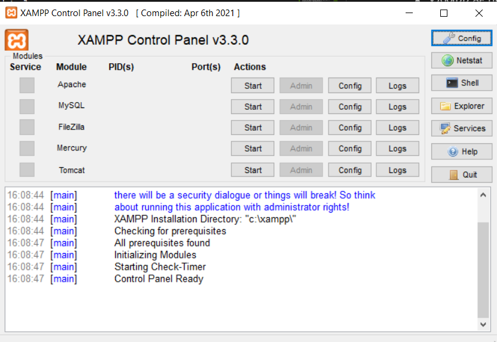

# SI-Investigar-tecnologias

## 1- Ejemplos actuales de servidores web.

**APACHE**
- Es el servidor web de referencia, el más popular y extendido. Lleva 25 años siendo el líder indiscutible, a pesar de que nuevos competidores le hayan robado cuota de mercado. Su principal ventaja es que es gratuito y de código abierto, por lo que se puede instalar en casi todos los sistemas operativos. Su desfasada arquitectura frente a otros tipos de servidor es su principal punto débil.

**Ngnix**
- También open source y gratuito (aunque ofrece una versión comercial), destaca por su alto rendimiento. Utiliza un proxy inverso, que protege la identidad de los servidores y mejora la seguridad de la información que acogen.

## 2- Ejemplos actuales de servidores de aplicaciones

**Tomcat**
- Es un contenedor de aplicaciones web de código abierto basado en Java que ejecuta aplicaciones web de servlet y JSP. Tomcat Server se ejecuta de acuerdo con las especificaciones de servlet y JSP, por lo que podemos decir que Tomcat Server también implementa la especificación Apache-Jakarta y es mejor que la mayoría de los servidores de software de aplicaciones comerciales.

**IBM WebSphere**
- Es un servidor de aplicaciones web totalmente funcional y abierto. Es una parte central del plan de comercio electrónico de IBM. Es un entorno de aplicaciones basado en Java para el establecimiento, implementación y administración de Internet y aplicaciones Web de Intranet. Este conjunto de productos se ha ampliado para satisfacer las necesidades de los servidores de aplicaciones web, desde simples hasta avanzados y de nivel empresarial.

## 3- Ejemplos actuales de servidores de bases de datos.

**MySQL Server**
- MySQL ha sido desde hace décadas el líder indiscutido de bases de datos utilizadas en desarrollo web y de aplicaciones que utilizan lenguajes populares como PHP, Ruby o Python.
Es un servidor de bases de datos de tipo relacional, es considerada por muchos como la base de datos más popular del mundo.

- Se caracteriza por la ejecución de tareas en simultáneo tanto lectura como escritura y permite uso de índices, múltiples transacciones, balanceo de carga, clustering, backups en caliente.

**MongoDB**
- Es software libre, y a diferencia de MySQL, PostgreSQL y los demás, no guarda datos en tablas, sino en estructuras BSON (muy parecidas a JSON) dinámicas, algo que hace que su acceso sea rápido y fácil. Se caracteriza por ser multiplataforma, corriendo sin problemas en Windows, Linux, MacOS y Solaris.

## 4- Instala Xampp y habla sobre lo que puedes hacer con él.

*Recursos*: https://www.apachefriends.org/es/index.html

- XAMPP es un servidor independiente de plataforma de código libre. Te permite instalar de forma sencilla Apache en tu propio ordenador, sin importar tu sistema operativo (Linux, Windows, MAC  o Solaris). Y lo mejor de todo es que su uso es gratuito.

- Incluye además servidores de bases de datos como MySQL ySQLite con sus respectivos gestores phpMyAdmin y phpSQLiteAdmin. Incorpora también el intérprete de PHP, el intérprete de Perl, servidores de FTP como ProFTPD ó FileZilla FTP Serve, etc. entre muchas cosas más.

## 5- ¿Qué es docker?

Es una plataforma de software que le permite crear, probar e implementar aplicaciones rápidamente. Docker empaqueta software en unidades estandarizadas llamadas contenedores que incluyen todo lo necesario para que el software se ejecute, incluidas bibliotecas, herramientas de sistema, código y tiempo de ejecución. Con Docker, puede implementar y ajustar la escala de aplicaciones rápidamente en cualquier entorno con la certeza de saber que su código se ejecutará.

La ejecución de Docker en AWS les ofrece a desarrolladores y administradores una manera muy confiable y económica de crear, enviar y ejecutar aplicaciones distribuidas en cualquier escala.